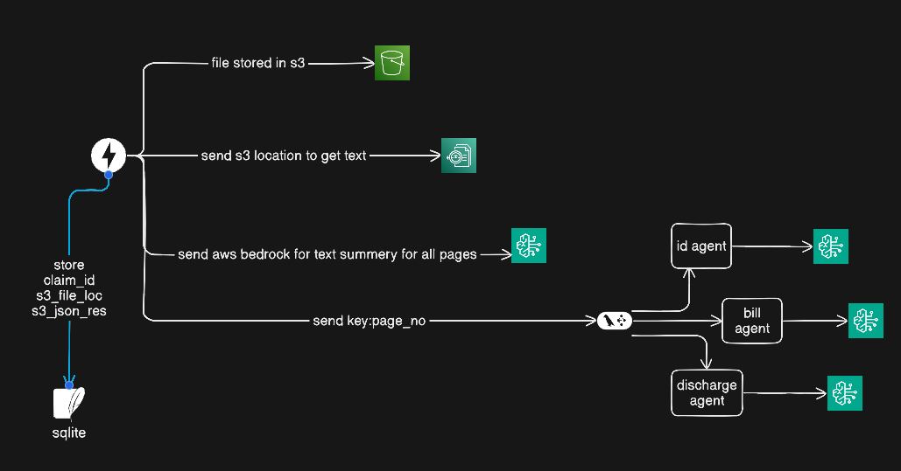

# health-check


# Medical Claim Intelligence System (FastAPI & LangGraph)

A high-performance, modular extraction engine built with **FastAPI**, **LangGraph**, and **AWS (Textract + Bedrock)**. This system is designed to handle complex, multi-page medical claim PDFs (like the 18-page samples) by using a multi-agent "fan-out" architecture.

## How it Works
Unlike basic OCR scripts, this system acts like a digital claims department:
1. **OCR Layer**: Uses AWS Textract to extract raw text and table data asynchronously.
2. **Segregator Agent**: Analyzes page previews to route specific pages to specialist agents.
3. **Specialist Agents**: ID, Billing, and Clinical agents run in **parallel** to extract structured data using Claude 3.5 Sonnet.
4. **Validation**: Pydantic schemas enforce data integrity before saving the final results to S3.

---

## 1. Prep your environment
We use `uv` because it's significantly faster for dependency management.

```bash
# Create and activate virtual environment
uv venv
source .venv/bin/activate

# Install dependencies
uv pip install -r requirements.txt

export AWS_REGION="us-east-1"
# Also ensure AWS_ACCESS_KEY_ID and AWS_SECRET_ACCESS_KEY are set

uv run uvicorn app.main:app --reload